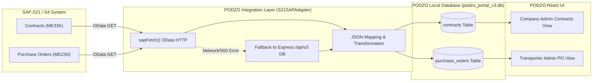
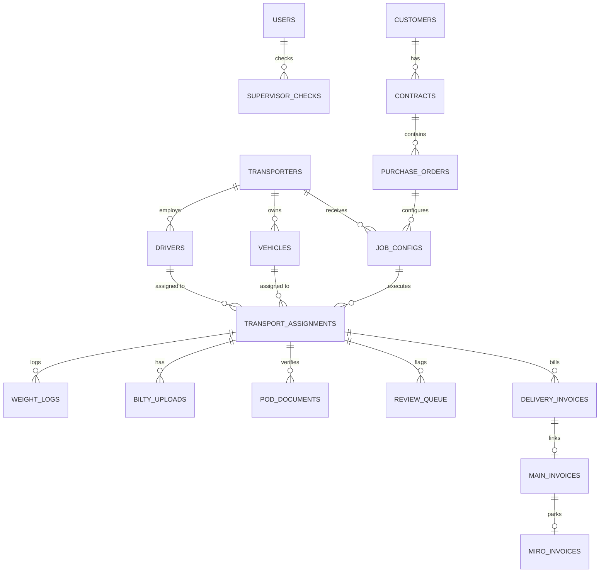

# PODZO — Complete Project Knowledge Base

```
================================================================================
                    PODZO — SINGLE SOURCE OF TRUTH
                      PROJECT KNOWLEDGE BASE
================================================================================
```

---

## 1. DOCUMENT CONTROL

| Attribute | Details |
| :--- | :--- |
| **Project Name** | PODZO (Transporter Proof-of-Delivery & Invoice Automation System) |
| **Tagline** | Let's make delivery simple. |
| **Document File** | `PODZO_PROJECT_KNOWLEDGE.md` |
| **Document Version** | `3.0.0` (Reflecting V3 Architecture & SQLite Schema V3) |
| **Generated Date** | `2026-08-22` |
| **Documentation Status** | **AUDITED & VERIFIED FROM CODEBASE** |
| **Source of Truth** | Repository Source Code (`/src`, `/server`, `/db`, `/docs`) |
| **Repository Analyzed** | `Varad-6/POD` (`C:\projects\POD`) |
| **Environment Analyzed** | Node.js Express Backend (V3) + Vite React 19 Frontend + SQLite (`podzo_portal_v3.db`) |
| **Last Verified State** | V3 Multi-Persona Workflow Operational (Express 5.2.1, SQLite better-sqlite3 13.0.3, React 19.2.7, Vite 8.1.1) |

---

## 2. EXECUTIVE SUMMARY

### 2.1 Product Purpose & Category
**PODZO** is an AI-assisted, logistics execution and Proof-of-Delivery (POD) verification platform designed for industrial bulk haulage, mining logistics (such as coal, minerals, and aggregates), and transport operations. It sits between enterprise resource planning systems (specifically **SAP S4/HANA / SAP S21**) and physical transport execution.

### 2.2 Main Business Problem
In industrial haulage, significant financial leakage and processing delays occur due to:
1. **Manual Paper POD Processing**: Delivery slips are paper-based, leading to delayed invoice processing (often 30–90 days).
2. **Weight Discrepancies & Theft**: Discrepancies between dispatch net weights at the mine siding and received net weights at customer sites (e.g., power stations or factories) often go undetected or unverified.
3. **Fraudulent / Unclear Invoicing**: Invoices are raised manually against incorrect weights or rates without cross-checking weighbridge logs.
4. **Lack of Operational Visibility**: Mine managers, transporters, drivers, and customers operate in data silos without a shared real-time ledger.

### 2.3 Primary Users & Stakeholders
PODZO serves 5 primary operational personas:
1. **Company Admin (`CA`)**: Mine/Logistics Manager (e.g., Ikwezi Logistics) who oversees contracts, PO distribution, review queue resolution, and invoice posting.
2. **Transporter Admin (`TA`)**: Transport vendor logistics supervisor (e.g., Sipho Transport Services) who accepts POs and schedules drivers/vehicles.
3. **Driver (`DR`)**: Logistics truck driver carrying consignments, logging trip milestones, accepting e-signatures, and scanning POD slips.
4. **Weighbridge Supervisor (`SR`)**: Mine siding gate operator managing initial tare/gross weighments, credential checks, and supervisor stamps.
5. **Customer (`CR`)**: Destination receiving manager (e.g., Eskom Holdings) managing destination tare/gross weighments, verifying OTPs, and stamping delivery slips.

### 2.4 High-Level Workflow Overview
```
[ SAP S21 / S4 ] ──(Sync Contracts & POs)──► [ PODZO System ]
                                                    │
                                         (Job Config & Assignment)
                                                    ▼
[ Mine Siding Gate ] ──(Mine Tare & Gross Weighbridge)──► [ Dispatch / Bilty ]
                                                                 │
                                                        (Transit / GPS / OTP)
                                                                 ▼
[ Customer Receiving Gate ] ──(Dest Gross & Tare Weighbridge)──► [ POD Upload ]
                                                                       │
                                                            (OCR & Match Verification)
                                                                       ▼
[ Company Admin Review ] ──(Tolerance & OCR Clearance)──► [ MIRO Parked Invoice ]
```

---

## 3. PRODUCT IDENTITY

* **Product Name**: PODZO
* **Tagline**: *Let's make delivery simple.*
* **Brand Identity**:
  * **Logo Component**: Standardized SVG Logo (`src/components/branding/PodzoLogo.tsx`) featuring styled transport mark and typography.
  * **Color Palette**: Dark Industrial Modern (Navy `#0A192F`, Slate `#1E293B`, Primary Accent `#FF5B00` / `#2563EB`, Success `#10B981`, Warning `#F59E0B`, Danger `#EF4444`).
* **Product Scope & Positioning**:
  PODZO combines:
  $$\text{POD Verification} + \text{Transport Execution} + \text{Weighbridge Reconciliation} + \text{Automated Invoicing}$$

---

## 4. BUSINESS PROBLEM & DETAILED OPERATIONAL FLOW

### 4.1 End-to-End Business Flow
```
SAP / S21 (Contracts & POs)
   │
   ▼
1. Contract Creation & Import (SAP Outline Agreement)
   │
   ▼
2. Purchase Order Distribution (SAP Transport PO)
   │
   ▼
3. Job Configuration & Transporter Assignment (Transporter Admin)
   │
   ▼
4. Driver & Vehicle Pairing (Transporter Admin)
   │
   ▼
5. Driver E-Signature & PO Acceptance (Driver Canvas)
   │
   ▼
6. Pre-Dispatch Weighbridge Gate 1 (Mine Tare Weight - Empty Truck)
   │
   ▼
7. Pre-Dispatch Weighbridge Gate 2 (Mine Gross Weight - Loaded Truck -> Bilty Issued)
   │
   ▼
8. Dispatch & Transit Event Tracking (Driver OTP & Geofencing)
   │
   ▼
9. Destination Arrival & Geofence Check (Customer Gate)
   │
   ▼
10. Destination Weighbridge Gate 3 (Dest Gross Weight - Loaded Truck)
   │
   ▼
11. Offloading & Destination Weighbridge Gate 4 (Dest Tare Weight - Empty Truck)
   │
   ▼
12. Customer Verification & Physical Stamped POD Issued
   │
   ▼
13. POD Upload & OCR Processing (Driver / Transporter Uploads Image)
   │
   ▼
14. Automated Dual Weight Reconciliation & OCR Match Check
   ├── IF Match & Within Tolerance (e.g., <= 0.5%) ──► AUTO-APPROVED
   └── IF Mismatch OR Exceeds Tolerance ────────────► FLAGGED TO REVIEW QUEUE
   │
   ▼
15. Company Admin Review Queue Resolution (Manual Audit & Approval)
   │
   ▼
16. Freight Rate Calculation & Delivery Invoice Generation
   │
   ▼
17. MIRO Invoice Parking & Clearing in SAP (Parked -> Posted -> Cleared)
```

---

## 5. SYSTEM BOUNDARY

```
+-----------------------------------------------------------------------+
|                             SAP S21 / S4                              |
|   (System of Record for Financials, Contracts, & Master PO Data)       |
+-----------------------------------------------------------------------+
                                  │
                                  │ READ ONLY / SYNC (Contracts & POs)
                                  ▼
+-----------------------------------------------------------------------+
|                             PODZO SYSTEM                              |
|               (Operational & Delivery Execution Layer)                |
|                                                                       |
|  * Operational Storage:                                               |
|    - Driver & Vehicle Assignments                                     |
|    - Dual Gate Weighbridge Logs (Mine Tare/Gross, Dest Gross/Tare)    |
|    - Driver E-Signatures & OTP Tokens                                 |
|    - Transit Events & GPS Logs                                        |
|    - Scanned POD Documents & OCR Metadata                             |
|    - Review Queue Exceptions & Approvals                              |
|    - Freight Delivery Invoices & MIRO Parking Local State             |
+-----------------------------------------------------------------------+
```

### 5.1 Real Data vs Operational Data
* **Real SAP S21 Data** (Preserved across system demo resets):
  * Contracts (`contracts` table: `sap_contract_no`, customer references, valid dates, materials).
  * Purchase Orders (`purchase_orders` table: `sap_po_no`, target quantity, unit rate, tolerance percentage).
* **PODZO Operational Data** (Wiped during system demo resets):
  * Job configurations (`job_configs`).
  * Transport assignments (`transport_assignments`).
  * Weighbridge logs (`weight_logs`).
  * OTP verifications (`otp_verifications`).
  * Bilty / Waybill uploads (`bilty_uploads`).
  * POD Documents & OCR extracted values (`pod_documents`).
  * Review Queue flags (`review_queue`).
  * Delivery & MIRO invoices (`delivery_invoices`, `main_invoices`, `miro_invoices`).

### 5.2 SAP S21 Write-Back Status
> [!IMPORTANT]
> **NOT IMPLEMENTED / NO AUTOMATIC LIVE WRITE-BACK**
> In the current codebase, automatic live write-back from PODZO into SAP S21 ERP production tables is **NOT IMPLEMENTED**. Live SAP S21 calls in `S21SAPAdapter.ts` fetch contracts and POs via GET endpoints. Write-back actions (such as posting MIRO invoices or acknowledging POs) return mock execution structures or fall back to local database entries (`MockSAPAdapter.ts`).

---

## 6. S21 INTEGRATION TECHNICAL SPECIFICATION

### 6.1 Integration Architecture
* **Adapter Pattern**: Implemented in TypeScript via `ISAPAdapter` interface (`src/services/ISAPAdapter.ts`).
* **Adapters Available**:
  1. `S21SAPAdapter.ts` — Real SAP OData HTTP client with automatic fallback to local Express database endpoints.
  2. `MockSAPAdapter.ts` — Standalone local mock adapter.
* **Configuration Parameters** (`.env` & `.env.example`):
  * `VITE_SAP_S21_BASE_URL`: Base URL for SAP S21 Gateway (Default: `''`).
  * `VITE_SAP_S21_CLIENT`: SAP Client ID (Default: `'100'`).
  * `VITE_SAP_S21_SYSTEM_ID`: System ID (Default: `'S21'`).
  * `VITE_SAP_S21_PROXY_URL`: Proxy server URL for CORS handling (Default: `''`).
  * `VITE_SAP_S21_CONTRACTS_ENDPOINT`: `/ZPOD_CONTRACTS_SRV/ContractSet`
  * `VITE_SAP_S21_POS_ENDPOINT`: `/ZPOD_PURCHASE_ORDERS_SRV/PurchaseOrderSet`
  * `VITE_SAP_S21_ACKNOWLEDGE_PO_ENDPOINT`: `/ZPOD_PO_ACK_SRV/AcknowledgePOSet`

### 6.2 Endpoint & Data Fetching Mapping
* **Contracts Fetch**:
  * **OData Endpoint**: `/ZPOD_CONTRACTS_SRV/ContractSet?$filter=Status eq 'ACTIVE'`
  * **SAP Field Mapping**:
    * `ContractNumber` / `EBELN` $\rightarrow$ `contractNumber`
    * `QualityType` / `TXZ01` $\rightarrow$ `qualityType`
    * `TargetQuantity` / `KTMNG` $\rightarrow$ `targetQuantity`
    * `Uom` / `MEINS` $\rightarrow$ `uom`
    * `NetValue` / `NETWR` $\rightarrow$ `netValue`
    * `Rate` / `NETPR` $\rightarrow$ `rate`
    * `ValidFrom` / `KDATB` $\rightarrow$ `validFrom`
    * `ValidTo` / `KDATE` $\rightarrow$ `validTo`
* **Purchase Orders Fetch**:
  * **OData Endpoint**: `/ZPOD_PURCHASE_ORDERS_SRV/PurchaseOrderSet?$filter=Status ne 'CANCELLED'`
  * **SAP Field Mapping**:
    * `PurchaseOrderNo` / `EBELN` $\rightarrow$ `purchaseOrderNo`
    * `ContractRef` / `KONNR` $\rightarrow$ `contractRef`
    * `Rate` / `NETPR` $\rightarrow$ `rate`
    * `TargetQuantity` / `MENGE` $\rightarrow$ `targetQuantity`
    * `CostCenter` / `KOSTL` $\rightarrow$ `costCenter`

### 6.3 Security & Secret Handling
Secrets and credentials are **NEVER** stored in source code. Environment variables use placeholders:
```env
VITE_SAP_S21_BASE_URL=[REDACTED]
VITE_SAP_S21_CLIENT=[REDACTED]
```

---

## 7. S21 DATA FLOW



---

## 8. PERSONAS & ROLE-BASED ACCESS CONTROL (RBAC)

### 8.1 Persona Matrix
| Role Code | Role Name | Primary Responsibilities | Demo User Accounts (`logins.md` / `seed_v3.sql`) | Default UI View |
| :--- | :--- | :--- | :--- | :--- |
| **`CA`** | Company Admin | Upload contracts, assign POs, resolve review queue, approve invoices, execute demo resets | `ca_thandiwe`, `company_admin` | `AdminDashboard.tsx`, `AdminContracts.tsx`, `AdminApprovals.tsx`, `AdminInvoices.tsx` |
| **`TA`** | Transporter Admin | Review POs, configure jobs, assign drivers and vehicles to runs | `ta_sipho`, `transporter_admin`, `transporter_cbs`, `transporter_mpl` | `TransporterDashboard.tsx`, `TransporterPOs.tsx`, `TransporterPODs.tsx`, `TransporterInvoices.tsx` |
| **`DR`** | Driver | Sign PO acceptances, log pickup OTP, confirm site arrival, log delivery, upload POD slip | `dr_zweli`, `driver`, `driver_austin`, `driver_jan`, `driver_lucky` | `DriverDashboard.tsx` |
| **`SR`** | Weighbridge Supervisor | Log mine tare/gross weighbridge weights, verify driver credentials, issue supervisor stamp | `sr_gate01`, `supervisor` | `SupervisorDashboard.tsx` |
| **`CR`** | Customer Receiver | Log destination gross/tare weighbridge weights, verify delivery OTP, issue stamped POD | `cr_mining`, `customer` | `CustomerDashboard.tsx` |

### 8.2 Authentication & Security Architecture
* **Authentication Method**: JWT (JSON Web Tokens) generated using `jsonwebtoken`.
* **Password Storage**: Hashed using `bcryptjs` (Cost factor: 10). Demo password: `password123` or `Demo@1234`.
* **Backend Middleware**: Defined in `server/middleware/auth_v3.ts`:
  * `requireAuth`: Verifies `Authorization: Bearer <token>` header.
  * `requireRole(...roles)`: Enforces RBAC permissions based on `req.user.role`.

---

## 9. CORE WORKFLOWS & DATA PROCESSING

### 9.1 Weighbridge Reconciliation & Quad-Gate Weight Flow
PODZO records weights at 4 distinct weighbridge checkpoints across 2 locations:

```
[ MINE SIDING ]
  Gate 1: MINE_TARE  (Empty Truck Weight)  ──► Recorded in weight_logs
  Gate 2: MINE_GROSS (Loaded Truck Weight) ──► Recorded in weight_logs
  Net Mine Payload = MINE_GROSS - MINE_TARE

[ CUSTOMER RECEIVING SITE ]
  Gate 3: DEST_GROSS (Loaded Truck Weight) ──► Recorded in weight_logs
  Gate 4: DEST_TARE  (Empty Truck Weight)  ──► Recorded in weight_logs
  Net Delivered Payload = DEST_GROSS - DEST_TARE
```

* **Variance Formula**:
  $$\text{Variance (kg)} = |\text{Net Mine Payload} - \text{Net Delivered Payload}|$$
  $$\text{Variance (\%)} = \frac{\text{Variance (kg)}}{\text{Net Mine Payload}} \times 100$$
* **Tolerance Check**:
  Compared against `purchase_orders.tolerance_pct` (typically `0.5%`).
  * If $\text{Variance (\%)} \le \text{Tolerance (\%)}$: Flagged as `WITHIN_TOLERANCE`.
  * If $\text{Variance (\%)} > \text{Tolerance (\%)}$: Flagged as `OUTSIDE_TOLERANCE` and pushed to `review_queue` with `flag_reason = 'TOLERANCE_EXCEEDED'`.

### 9.2 POD Document Upload & OCR Verification Logic
1. **Upload**: Driver or Transporter Admin uploads scanned POD PDF or image file (`/uploads` endpoint).
2. **OCR Parsing Execution**:
   * *Prototype/Demo Mode*: Uses filename-based simulator (`OCRSim` / `getOCRData`).
     * `delivery-slip-match.jpg` $\rightarrow$ Waybill: `WB-998821`, Weight: `34.82 TON`, Confidence: `98%`, Match: `MATCH`.
     * `delivery-slip-mismatch.jpg` $\rightarrow$ Waybill: `WB-998821`, Weight: `31.50 TON`, Confidence: `95%`, Match: `MISMATCH`.
     * `delivery-slip-blurry.jpg` $\rightarrow$ Waybill: `UNKNOWN`, Weight: `0.00 TON`, Confidence: `42%`, Match: `MISMATCH`.
3. **Database Insertion**:
   Recorded in `pod_documents` table with `ocr_waybill_extracted`, `ocr_weight_extracted`, `ocr_confidence_pct`, and `match_status`.
4. **Automated Review Queue Trigger**:
   If `match_status === 'MISMATCH'` or `ocr_confidence_pct < 80.0`, an exception entry is created in `review_queue` with `flag_reason = 'OCR_MISMATCH'` and `blocks_miro_bool = 1`.

### 9.3 Review Queue & Exception Resolution
* **Blocking Mechanism**: Any unresolved item in `review_queue` (`status = 'OPEN'`, `blocks_miro_bool = 1`) strictly prevents invoice parking.
* **Resolution Action**: Company Admin (`CA`) inspects side-by-side comparison modal (`AdminApprovals.tsx`), inputs resolution notes, and executes resolution:
  * **Approve Override**: Sets `review_queue.status = 'RESOLVED'`, updates assignment status to `APPROVED`, enabling invoice generation.
  * **Reject / Send Back**: Returns assignment status to `UNDER_REVIEW` with rejection reason.

### 9.4 Invoice Eligibility & Payment Clearance
1. **Rate Calculation**:
   $$\text{Total Invoice Amount} = \text{Accepted Net Delivered Payload (Tons)} \times \text{PO Freight Rate}$$
2. **Invoice Flow**:
   * Delivery Invoice created in `delivery_invoices` (`status = 'SENT_TO_CA'`).
   * Main Invoice linked in `main_invoices`.
   * MIRO Invoice record created in `miro_invoices` with initial status `PARKED`.
3. **MIRO Clearing**:
   Company Admin executes MIRO posting $\rightarrow$ Status updates to `POSTED` $\rightarrow$ Payment clearing updates status to `CLEARED` with simulated SAP reference document number.

### 9.5 Demo Reset Functionality (`POST /api/v3/demo/reset`)
* **Purpose**: Resets prototype state back to initial clean state between live demonstrations.
* **Implementation** (`server/routes/api_v3.ts`, `server/db/reset_db_v3.ts`):
  * Disables SQLite foreign key constraints temporarily (`PRAGMA foreign_keys = OFF`).
  * Wipes all operational execution tables (`transport_assignments`, `job_configs`, `weight_logs`, `otp_verifications`, `pod_documents`, `review_queue`, `delivery_invoices`, `miro_invoices`, `transit_events`, etc.).
  * **Preserves Real S21 Data**: `contracts` and `purchase_orders` tables remain untouched.
  * Resets all Purchase Orders status back to `'OPEN'`.
  * Re-enables foreign key constraints and logs audit record into `demo_reset_audit`.

---

## 10. DATABASE SCHEMA SPECIFICATION (SQLite Schema V3)

The system relies on SQLite (`podzo_portal_v3.db`) managed via `better-sqlite3`. Defined in `server/db/schema_v3.sql`.



### Table Specifications

#### 1. `users`
* `id` INTEGER PRIMARY KEY AUTOINCREMENT
* `username` TEXT UNIQUE NOT NULL
* `password_hash` TEXT NOT NULL
* `role` TEXT NOT NULL CHECK(role IN ('CA', 'TA', 'DR', 'CR', 'SR'))
* `display_name` TEXT NOT NULL
* `email` TEXT UNIQUE
* `phone` TEXT
* `entity_id` INTEGER
* `created_at` TEXT DEFAULT (datetime('now'))

#### 2. `contracts`
* `id` INTEGER PRIMARY KEY AUTOINCREMENT
* `sap_contract_no` TEXT UNIQUE NOT NULL
* `customer_id` INTEGER NOT NULL REFERENCES customers(id)
* `start_date` TEXT NOT NULL
* `end_date` TEXT NOT NULL
* `pdf_url` TEXT
* `status` TEXT CHECK(status IN ('ACTIVE', 'EXPIRED', 'TERMINATED')) DEFAULT 'ACTIVE'

#### 3. `purchase_orders`
* `id` INTEGER PRIMARY KEY AUTOINCREMENT
* `contract_id` INTEGER NOT NULL REFERENCES contracts(id)
* `sap_po_no` TEXT UNIQUE NOT NULL
* `material` TEXT NOT NULL
* `uom` TEXT NOT NULL
* `target_qty` REAL NOT NULL
* `rate` REAL NOT NULL
* `tolerance_pct` REAL NOT NULL
* `cost_center` TEXT
* `status` TEXT CHECK(status IN ('OPEN', 'ASSIGNED', 'IN_PROGRESS', 'COMPLETED', 'CANCELLED')) DEFAULT 'OPEN'

#### 4. `transport_assignments`
* `id` INTEGER PRIMARY KEY AUTOINCREMENT
* `job_config_id` INTEGER NOT NULL REFERENCES job_configs(id)
* `driver_id` INTEGER NOT NULL REFERENCES drivers(id)
* `vehicle_id` INTEGER NOT NULL REFERENCES vehicles(id)
* `license_no` TEXT NOT NULL
* `gstin` TEXT NOT NULL
* `scheduled_date` TEXT NOT NULL
* `status` TEXT CHECK(status IN ('ASSIGNED', 'GATE_DENIED', 'MINE_TARE_LOGGED', 'MINE_GROSS_LOGGED', 'DISPATCHED', 'EN_ROUTE', 'ARRIVED', 'DELIVERED', 'POD_UPLOADED', 'UNDER_REVIEW', 'APPROVED', 'INVOICED', 'MIRO_PARKED', 'MIRO_POSTED', 'CLEARED')) DEFAULT 'ASSIGNED'

#### 5. `weight_logs`
* `id` INTEGER PRIMARY KEY AUTOINCREMENT
* `assignment_id` INTEGER NOT NULL REFERENCES transport_assignments(id)
* `stage` TEXT CHECK(stage IN ('MINE_TARE', 'MINE_GROSS', 'DEST_GROSS', 'DEST_TARE'))
* `weight_kg` REAL NOT NULL
* `logged_at` TEXT DEFAULT (datetime('now'))

#### 6. `pod_documents`
* `id` INTEGER PRIMARY KEY AUTOINCREMENT
* `assignment_id` INTEGER UNIQUE NOT NULL REFERENCES transport_assignments(id)
* `pod_file_url` TEXT NOT NULL
* `ocr_waybill_extracted` TEXT
* `ocr_weight_extracted` REAL
* `ocr_confidence_pct` REAL
* `match_status` TEXT CHECK(match_status IN ('MATCH', 'MISMATCH', 'PENDING')) DEFAULT 'PENDING'

#### 7. `review_queue`
* `id` INTEGER PRIMARY KEY AUTOINCREMENT
* `assignment_id` INTEGER NOT NULL REFERENCES transport_assignments(id)
* `flag_reason` TEXT CHECK(flag_reason IN ('OCR_MISMATCH', 'TOLERANCE_EXCEEDED', 'AWAITING_CA_VERIFY'))
* `status` TEXT CHECK(status IN ('OPEN', 'RESOLVED')) DEFAULT 'OPEN'
* `resolved_by_role` TEXT CHECK(resolved_by_role IN ('CA', 'TA', 'SR'))
* `resolved_by_user_id` INTEGER REFERENCES users(id)
* `resolution_notes` TEXT
* `blocks_miro_bool` INTEGER CHECK(blocks_miro_bool IN (0, 1)) DEFAULT 1
* `created_at` TEXT DEFAULT (datetime('now'))

#### 8. `delivery_invoices` / `miro_invoices`
* Stores calculated freight billing values, SAP document numbers (`sap_invoice_no`), and MIRO states (`PARKED`, `POSTED`, `CLEARED`).

---

## 11. API ENDPOINT REFERENCE

All V3 API routes are prefixed with `/api/v3` and mounted in `server/index.ts`. Auth routes mounted under `/api/v3/auth`.

| Method | Endpoint | Auth | Role | Description |
| :--- | :--- | :--- | :--- | :--- |
| `POST` | `/api/v3/auth/login` | None | Public | User authentication with username & password |
| `GET` | `/api/v3/auth/me` | JWT | Any | Get currently authenticated user details |
| `GET` | `/api/v3/contracts` | JWT | Any | Fetch all active contracts |
| `GET` | `/api/v3/purchase-orders` | JWT | Any | Fetch purchase orders (optionally filter by `contract_id`) |
| `GET` | `/api/v3/assignments` | JWT | `CA`, `TA`, `SR` | Fetch transport assignments and weight logs |
| `POST` | `/api/v3/assignments` | JWT | `TA` | Create new transport job configuration & assignment |
| `POST` | `/api/v3/weighbridge/log` | JWT | `SR`, `CR` | Log weight log at stage (`MINE_TARE`, `MINE_GROSS`, `DEST_GROSS`, `DEST_TARE`) |
| `POST` | `/api/v3/pod/upload` | JWT | `DR`, `TA` | Upload scanned POD slip, execute OCR verification |
| `GET` | `/api/v3/review-queue` | JWT | `CA`, `SR` | Fetch open review queue exception items |
| `POST` | `/api/v3/review-queue/:id/resolve` | JWT | `CA` | Resolve flagged exception and unblock MIRO |
| `POST` | `/api/v3/invoices/generate` | JWT | `TA`, `CA` | Generate delivery invoice for approved assignment |
| `POST` | `/api/v3/invoices/:id/post-miro` | JWT | `CA` | Post parked MIRO invoice in SAP |
| `POST` | `/api/v3/demo/reset` | JWT | `CA` | System-wide demo reset (wipes execution, preserves S21) |

---

## 12. FRONTEND ARCHITECTURE & COMPONENTS

* **Framework**: React 19 + TypeScript + Vite 8 + React Router DOM 7.
* **Views Directory** (`src/views/`):
  * `Login.tsx`: Multi-persona quick selector and credentials login.
  * `AdminDashboard.tsx`: Executive dashboard for Company Admin (`CA`).
  * `AdminContracts.tsx`: Contract management and PO distribution.
  * `AdminApprovals.tsx`: Review queue exception audit and side-by-side OCR comparison.
  * `AdminInvoices.tsx`: MIRO invoice parking & payment clearing dashboard.
  * `TransporterDashboard.tsx`: Transporter Admin (`TA`) fleet summary.
  * `TransporterPOs.tsx`: PO acceptance and driver assignment workflow.
  * `TransporterPODs.tsx`: Waybill offload records and POD upload manager.
  * `TransporterInvoices.tsx`: Transporter freight invoice submission.
  * `DriverDashboard.tsx`: Mobile-responsive driver view for signatures, OTP, and photo capture.
  * `SupervisorDashboard.tsx`: Siding weighbridge check-in gate controller.
  * `CustomerDashboard.tsx`: Destination customer site receiving gate controller.
* **Shared Components** (`src/components/`):
  * `SignaturePad.tsx`: HTML5 canvas for capturing e-signatures.
  * `FileUploadBox.tsx`: Drag-and-drop file upload with progress indicator.
  * `WeightVarianceCard.tsx`: Visual widget rendering weight variance percentages against tolerance thresholds.
  * `StatusBadge.tsx`: Color-coded badge indicator for all assignment & invoice states.
  * `ContractPoSelector.tsx`: Dropdown context filter for active contract and PO scope.

---

## 13. CURRENT IMPLEMENTATION STATUS

### 13.1 Fully Implemented
- [x] Full-stack V3 Architecture with SQLite database (`podzo_portal_v3.db`).
- [x] 5-Persona RBAC system with JWT authentication and quick-access login selector.
- [x] Quad-gate weighbridge logging (`MINE_TARE`, `MINE_GROSS`, `DEST_GROSS`, `DEST_TARE`).
- [x] Dual-weight reconciliation and variance calculations against percentage tolerance thresholds.
- [x] POD upload with simulated OCR extraction & side-by-side comparison modal.
- [x] Automated review queue flagging for OCR mismatches and tolerance breaches.
- [x] Freight invoice calculation (`Net Delivered Payload * PO Rate`).
- [x] Transactional Demo Reset (`POST /api/v3/demo/reset`) preserving S21 Contracts/POs while clearing operational executions.
- [x] Interactive E-signature drawing canvas component.

### 13.2 Partially Implemented / Simulated
- [!] **OCR Engine**: Simulated via static pattern matching (`OCRSim` / filename mapping). Real cloud AI OCR (e.g., AWS Textract / Google Document AI) is **NOT CONNECTED**.
- [!] **SAP S21 Synchronization**: Fetching contracts/POs via OData GET is implemented with Express fallback. Automatic RFC/OData posting of MIRO invoices back into live SAP tables is **SIMULATED LOCAL STATE**.
- [!] **GPS Geofencing**: Distance calculations use Haversine formula in `api_v3.ts`, but browser live geolocation stream relies on mock coordinates in demo UI.

### 13.3 Not Implemented / Missing
- [ ] Direct database write-back to live SAP S21 tables.
- [ ] Hardware weighbridge serial/IoT device integration.
- [ ] Production SMS gateway for mobile OTP delivery (OTP codes rendered in UI).

---

## 14. KNOWN ISSUES & BROKEN FUNCTIONALITY

1. **Dual Schema Files**:
   * `server/db/schema_v3.sql` vs legacy `server/db/schema_v2.sql` and root `db/mockData.js`. V3 is the active schema, but legacy V2 routes remain mounted for backward compatibility.
2. **File Storage in Memory/Local Folder**:
   * Scanned PODs uploaded via `/api/v3/pod/upload` are stored in local `/uploads` directory. Production cloud object store (S3 / Azure Blob) is **NOT IMPLEMENTED**.
3. **Hardcoded Ports in SAP Adapter**:
   * `S21SAPAdapter.ts` fallback fetch explicitly targets `http://localhost:3001/api/v3/contracts`. Deployment to non-localhost environments requires configuring `VITE_SAP_S21_PROXY_URL` or dynamic base URL.

---

## 15. DEVELOPMENT & EXTENSION GUIDELINES

### 15.1 How to Run the Project
1. **Install Dependencies**:
   ```bash
   npm install
   ```
2. **Start Backend Express Server (Port 3001)**:
   ```bash
   npm run server
   ```
3. **Start Frontend Vite Dev Server (Port 5173)**:
   ```bash
   npm run dev
   ```
4. **Build for Production**:
   ```bash
   npm run build
   ```

### 15.2 How to Extend Database Schema
1. Edit `server/db/schema_v3.sql`.
2. Add necessary migration logic or table updates in `server/db/database_v3.ts`.
3. Update domain models in `src/types/domain.ts`.

### 15.3 Critical Rules for Maintainers
* **NEVER** modify `contracts` or `purchase_orders` tables during demo reset logic. S21 data must remain preserved.
* **ALWAYS** enforce `PRAGMA foreign_keys = ON` in SQLite operations outside of explicit bulk reset transactions.
* **DO NOT** remove fallback handlers in `S21SAPAdapter.ts` to ensure frontend demos function seamlessly offline.

```
================================================================================
                       END OF PODZO KNOWLEDGE BASE
================================================================================
```
