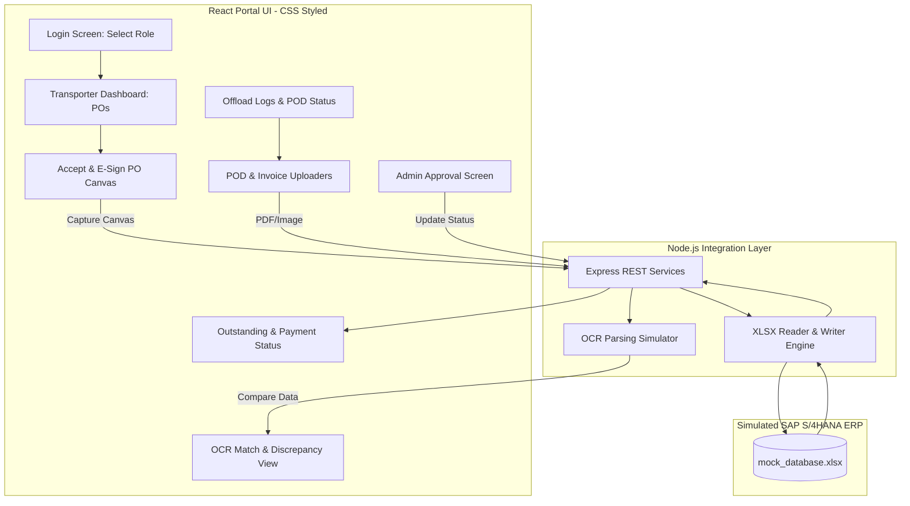

# Transporter Portal — Working Prototype & Demo Guide

This repository contains the working click-through prototype for the **Transporter Proof-of-Delivery (POD) Attachment & Invoice Automation** system. 

It is designed as a concept demo for **Ikwezi Mining Limited** to showcase the portal's user experience and business logic before full-scale integration with SAP S/4HANA begins.

---

## 1. Purpose of the Demo

To demonstrate the end-to-end operational flow of transporter management—from purchase order (PO) acceptance, offload verification, and OCR-based POD validation, through to automated invoice generation and outstanding visibility. 

This prototype runs on a **React (Vite) + Node.js + CSS** stack, utilizing a local **Excel workbook** (`mock_database.xlsx`) and an in-memory configuration file (`mockData.js`) to simulate standard SAP ERP tables.

---

## 2. System Architecture & Data Flow

Below is the conceptual architecture of the prototype. The React frontend interacts with standard REST endpoints on a Node.js backend. The backend reads and writes state changes to the Excel sheet, simulating an active SAP gateway.



---

## 3. Technology Stack

*   **Frontend**: React (Vite)
*   **Styling**: Pure CSS (Modern dark/light themes, card layouts, responsive layouts)
*   **Backend**: Node.js & Express
*   **Mock Database**: Microsoft Excel (`mock_database.xlsx`) powered by the `xlsx` or `exceljs` library on the backend, pre-loaded using `mockData.js`
*   **OCR Simulation**: Custom file-reading simulator mapping uploaded PDF/Images to SAP Waybill metadata

---

## 4. Repository Structure

```text
POD/
├── backend/
│   ├── database/
│   │   └── mock_database.xlsx     # Simulated SAP ERP Tables
│   ├── uploads/                   # Staged scanned PODs & invoices
│   ├── server.js                  # Express API Server
│   └── package.json               # Node dependencies (express, xlsx, multer)
├── frontend/
│   ├── src/
│   │   ├── data/
│   │   │   └── mockData.js        # Baseline static data in project
│   │   ├── components/            # Reusable UI widgets (Canvas, Uploaders)
│   │   ├── views/                 # Prototype screens (Login, Admin, Dashboards)
│   │   ├── App.jsx
│   │   ├── index.css              # Custom styling definitions
│   │   └── main.jsx
│   ├── package.json               # Frontend dependencies
│   └── vite.config.js
├── README.md                      # This file
└── SOP.md                         # Standard Operating Procedure (Production)
```

---

## 5. Demo Setup & Credentials

### A. Demo Logins (Static Credentials)
The prototype features two static profiles to demonstrate the workflows without database auth setup:

| Username | Password | Role / Entity |
| :--- | :--- | :--- |
| **`transporter`** | `password123` | Transporter (Sipho Transport Services) |
| **`admin`** | `password123` | Ikwezi Portal Manager (Mine Administrator) |

### B. Demo Assets / Upload Files
Ensure you have the following files saved on your laptop before starting the presentation. You will manually upload these files during the walkthrough:

| File Name | Purpose / What it Shows | When to Upload |
| :--- | :--- | :--- |
| **`delivery-slip-match.jpg`** | Clean match scenario: OCR readings match system records perfectly (shown in Green). | **Step 5** |
| **`delivery-slip-mismatch.jpg`** | Mismatch scenario: Weight read (32.5 tons) differs from recorded 34.8 tons (shown in Red). | **Step 10** |
| **`delivery-slip-blurry.jpg`** | Low-confidence scenario: File is too blurry; system forces manual Admin review. | **Step 11** |
| **`tax-bill-sample.pdf`** | Transporter invoice bill for auto-calculated payment step. | **Step 12** |

---

## 6. Detailed 14-Step Demo Walkthrough

Proceed through the following steps in sequence during the demo presentation:

### Phase 1: Transporter PO Acceptance & POD Upload
1.  **Step 1: Login as Truck Company**: Log in using the username `transporter` and password `password123`.
2.  **Step 2: Homepage Overview**: View your dashboard. It displays 3 key summary metrics:
    *   *Pending POs* (Awaiting Signature)
    *   *Deliveries Awaiting Paperwork*
    *   *Bill / Payment Ledger Status*
3.  **Step 3: Accept & E-Sign PO**: Click on a pending Purchase Order (showing rate per ton and total quantity). Draw your signature on the interactive signature canvas, and click **Accept**. The PO status changes to `Signed`.
4.  **Step 4: Go to Delivery Proof**: Navigate to the deliveries page. You will see a list of completed trips that are missing Proof-of-Delivery documents.
5.  **Step 5: Upload Match Document**: Click **Upload** next to the first weighbridge trip and select `delivery-slip-match.jpg`. A "Reading document..." spinner will run, and then the OCR extracted data (Waybill, Weight, Truck No) will display side-by-side with the system data. Since they match, it highlights in **Green**.
6.  **Step 6: Submit**: Click **Submit** to forward the verified POD to the mine manager.

### Phase 2: Mine Manager Approval
7.  **Step 7: Switch to Ikwezi Manager**: Log out and log back in using username `admin` and password `password123`.
8.  **Step 8: View Submitted Proofs**: Open the pending approval queue. You will see the POD submitted in Step 6.
9.  **Step 9: Review & Approve Match**: Select the entry. Verify the green side-by-side matching checklist and click **Approve**.

### Phase 3: Exception Handling (Mismatch & Blurry slips)
10. **Step 10: (Optional) Mismatch Demo**:
    *   Log back in as `transporter` and upload `delivery-slip-mismatch.jpg`.
    *   Log in as `admin`. The weight field will highlight in **Red** (discrepancy). 
    *   Demonstrate the two Admin options: **"Approve anyway"** (manual override) or **"Reject & Send Back"** (with reasons).
11. **Step 11: (Optional) Blurry Document Demo**:
    *   Log in as `transporter` and upload `delivery-slip-blurry.jpg`.
    *   The system flags a warning: *"Unclear text - manual verification required"*, preventing automatic pass-through.

### Phase 4: Auto-Invoicing & Payment
12. **Step 12: Raise Invoice**:
    *   Log back in as `transporter`. Locate the approved delivery.
    *   The system displays the auto-calculated amount:
        $$\text{Delivered Weight (Tons)} \times \text{Rate Per Ton}$$
    *   Enter your Tax Invoice Number, upload `tax-bill-sample.pdf`, and click **Submit**.
13. **Step 13: Approve Payment**:
    *   Log back in as `admin`. Locate the new invoice entry.
    *   Click **Post / Approve Payment** to simulate the standard SAP MIRO invoice posting and clearing loop.
14. **Step 14: Confirm Paid Status**:
    *   Log back in as `transporter` and navigate to the ledger.
    *   Observe your invoice status change from `Parked` $\rightarrow$ `Paid`, showing the payment reference transaction number and date.

---

## 7. Explicit Demo Exclusions

To maintain focus on the prototype development goals, the following components are simulated and not built out:
*   **Active SAP Gateway/OData connection**: No RFCs or live API calls are sent to an SAP sandbox; all sync loops read from and write to the local Excel sheets.
*   **Real OCR API Engine**: Documents are not parsed using costly cloud document intelligence APIs. The simulator maps uploaded file names to pre-seeded Excel data to mimic actual OCR reading.
*   **Security & Encryption**: No OAuth, token validations, or session management is implemented.
*   **Official Digital Signatures**: E-signatures are captured as lightweight draw-canvas images, not via official certificate authorities or Aadhaar APIs.
