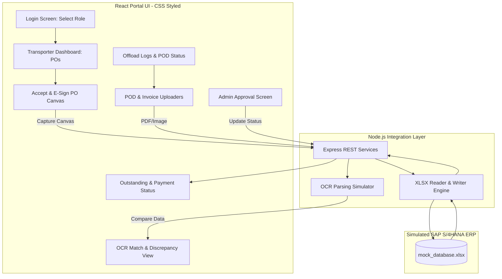

# Transporter Portal — Working Prototype & Demo Guide

This repository contains the working click-through prototype for the **Transporter Proof-of-Delivery (POD) Attachment & Invoice Automation** system. 

It is designed as a concept demo for **Ikwezi Mining Limited** to showcase the portal's user experience and business logic before full-scale integration with SAP S/4HANA begins.

---

## 1. Purpose of the Demo

To demonstrate the end-to-end operational flow of transporter management—from purchase order (PO) acceptance, offload verification, and OCR-based POD validation, through to automated invoice generation and outstanding visibility. 

This prototype runs on a **React (Vite) + Node.js + CSS** stack, utilizing a local **Excel workbook** (`mock_database.xlsx`) to simulate standard SAP ERP tables.

---

## 2. System Architecture & Data Flow

Below is the conceptual architecture of the prototype. The React frontend interacts with standard REST endpoints on a Node.js backend. The backend reads and writes state changes to the Excel sheet, simulating an active SAP gateway.



---

## 3. Technology Stack

*   **Frontend**: React (Vite)
*   **Styling**: Pure CSS (Modern dark/light themes, card layouts, responsive layouts)
*   **Backend**: Node.js & Express
*   **Mock Database**: Microsoft Excel (`mock_database.xlsx`) powered by the `xlsx` or `exceljs` library on the backend
*   **OCR Simulation**: Custom file-reading simulator mapping uploaded PDF/Images to SAP Waybill metadata

---

## 4. Repository Structure

```text
POD/
├── backend/
│   ├── database/
│   │   └── mock_database.xlsx     # Simulated SAP ERP Tables
│   ├── uploads/                   # Staged scanned PODs & invoices
│   ├── server.js                  # Express API Server
│   └── package.json               # Node dependencies (express, xlsx, multer)
├── frontend/
│   ├── src/
│   │   ├── components/            # Reusable UI widgets (Canvas, Uploaders)
│   │   ├── views/                 # Prototype screens (Login, Admin, Dashboards)
│   │   ├── App.jsx
│   │   ├── index.css              # Custom styling definitions
│   │   └── main.jsx
│   ├── package.json               # Frontend dependencies
│   └── vite.config.js
├── README.md                      # This file
└── SOP.md                         # Standard Operating Procedure (Production)
```

---

## 5. Installation & Setup

Follow these steps to run the prototype locally on your system.

### Step 1: Set Up the Mock Database
1. Navigate to the `backend/database/` directory.
2. Ensure you have the `mock_database.xlsx` file. (If initializing from scratch, run the database initialization script included in the backend directory).
3. The spreadsheet contains the following sheets representing SAP tables:
   *   `transporters`
   *   `purchase_orders`
   *   `offloads`
   *   `pod_submissions`
   *   `invoices`

### Step 2: Configure & Run the Backend API
1. Open your terminal and change directory to the backend folder:
   ```bash
   cd backend
   ```
2. Install the required Node packages:
   ```bash
   npm install
   ```
3. Start the mock integration API server:
   ```bash
   npm run dev
   ```
   *The server will spin up on `http://localhost:5000`.*

### Step 3: Configure & Run the React Frontend
1. Open a new terminal window and change directory to the frontend folder:
   ```bash
   cd frontend
   ```
2. Install the frontend dependencies:
   ```bash
   npm install
   ```
3. Start the Vite React local development server:
   ```bash
   npm run dev
   ```
   *The Vite server will start. Open `http://localhost:5173` in your browser.*

---

## 6. Simulated Flow Walkthrough (9 Click-Through Screens)

To demonstrate the application, proceed through these 9 distinct views:

1.  **Login screen**: Choose between logging in as a **Transporter** or **Ikwezi Portal Admin**.
2.  **Transporter PO Dashboard**: View active Purchase Orders synced from the Excel DB. Select an open PO.
3.  **PO Acceptance & E-Sign**: Sign the PO using the interactive drawing canvas. Submit to save e-sign metadata back to the PO sheet in the Excel DB.
4.  **Pending POD Dashboard**: View weighbridge offloads synced from SAP that are missing Proof-of-Delivery documents.
5.  **POD Document Upload**: Upload a simulated PDF scan or image of the POD.
6.  **OCR Matching Screen**: View extracted data (Truck No, Waybill No, Offload weight) side-by-side with SAP entries. If weights match within tolerance, it flags green; discrepancies trigger warning tags.
7.  **Admin Review Dashboard**: Log in as Ikwezi Admin to inspect the match confidence logs, view the physical document, and hit Approve to unlock invoicing.
8.  **Automated Invoice Creation**: Select approved deliveries. The system pulls rates from the PO sheet, auto-calculates total values, captures the Transporter's invoice details, and posts a "Parked" MIRO invoice back to the Excel DB.
9.  **Status & Outstanding Dashboard**: Monitor real-time status updates (e.g. Parked $\rightarrow$ Approved $\rightarrow$ Paid) and view outstanding balance ledgers.

---

## 7. Explicit Demo Exclusions

To maintain focus on the prototype development goals, the following components are simulated and not built out:
*   **Active SAP Gateway/OData connection**: No RFCs or live API calls are sent to an SAP sandbox; all sync loops read from and write to the local Excel sheets.
*   **Real OCR API Engine**: Documents are not parsed using costly cloud document intelligence APIs. The simulator maps uploaded file names to pre-seeded Excel data to mimic actual OCR reading.
*   **Security & Encryption**: No OAuth, token validations, or session management is implemented.
*   **Official Digital Signatures**: E-signatures are captured as lightweight draw-canvas images, not via official certificate authorities or Aadhaar APIs.
