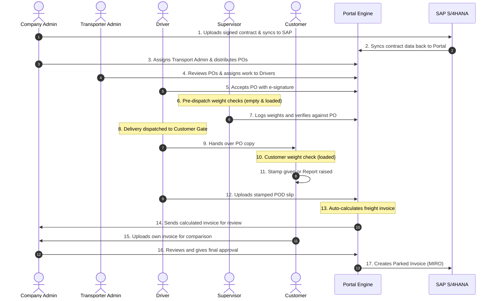

# Standard Operating Procedure (SOP)
## Transporter Portal — Proof-of-Delivery & Invoice Automation Project

*   **Document Owner**: Abhiyanta India Solutions Pvt. Ltd. (Delivery Team)
*   **Target Client**: Ikwezi Mining Limited
*   **System Environment**: SAP S/4HANA (On-Premise) + React Transporter Portal
*   **Version**: v1.0 (Production Blueprint Design)

---

## 1. Document Control

| Version | Date | Author | Status |
| :--- | :--- | :--- | :--- |
| v1.0 | 13-Jul-2026 | Abhiyanta | Production Blueprint Release |

---

## 2. Purpose & Objectives

This document establishes the Standard Operating Procedure (SOP) for the automated transporter freight management cycle. It covers the systems, roles, interface standards, and exceptions for the side-by-side Transporter Portal integrating with SAP S/4HANA (On-Premise).

The primary objectives are:
1.  **Standardization**: Build a unified portal where transporters review and digitally sign purchase orders (POs) and upload delivery paperwork.
2.  **Clean Core Integration**: Keep standard SAP core objects untouched by executing all custom logic through custom ABAP REST/OData Gateway endpoints.
3.  **OCR Verification**: Intercept fraud and typographical errors by running uploaded POD and transporter invoice documents through an Optical Character Recognition (OCR) validation gate.
4.  **Operational Efficiency**: Automate supplier invoice parking (MIRO) based on verified weights and PO condition rates, reducing manual checking by Ikwezi Accounts.

---

## 3. Roles & Responsibilities

### A. Company Admin
*   Uploads signed contracts and synchronizes them to SAP S/4HANA.
*   Assigns Transport Admins and distributes Purchase Orders (POs) to them.
*   Reviews automated invoice calculations and grants final invoice approvals.

### B. Transporter Admin
*   Reviews incoming POs from the Company Admin.
*   Assigns physical delivery tasks and PO runs to Drivers.
*   Monitors live shipment and dispatch statuses.

### C. Driver
*   Reviews and signs PO task acceptances using the portal's signature canvas.
*   Transports consignments and hands over PO documents physically to customers.
*   Uploads signed/stamped Proof-of-Delivery (POD) slips via the portal.

### D. Supervisor / Site Manager
*   Performs empty and loaded weight checks on trucks before dispatch.
*   Verifies weight logs against the PO to approve or halt dispatches.

### E. Customer
*   Conducts on-site verification weight checks on arrival.
*   Issues stamped confirmations or files defect/deviation reports.
*   Uploads customer invoice records to the Company Admin.

---

## 4. Standard Process Flow (Production Lifecycle)

> [!IMPORTANT]
> **REVISION NOTE**: This process flow supersedes the previously documented flow. The new version introduces two additional physical/manual verification checkpoints (**pre-dispatch weight check** and **customer-site weight check**) that were not part of the original SAP proposal's scope.



### Detailed Execution Steps:
1.  **Contract Seeding**: The Company Admin uploads the signed contract, synchronizing it with SAP to generate corresponding Purchase Orders (POs) and transport rates.
2.  **PO Assignment**: The Transporter Admin reviews active POs and assigns deliveries to specific drivers. The Driver reviews details and captures their e-signature on the Portal.
3.  **Weighbridge Verification (Pre-dispatch)**: The Weighbridge Supervisor checks the empty truck weight, loads the cargo, and checks the loaded truck weight. If the weights match the PO tolerances, the truck is allowed to dispatch.
4.  **Customer Site Weight Check**: Upon delivery, the customer performs their own weighbridge verification. If correct, they stamp the PO; if incorrect, they raise a report. The Driver scans and uploads this stamped POD to the Portal.
5.  **Auto Invoicing & Review**: The Portal automatically runs rate calculations and routes the invoice to the Company Admin. The Customer uploads their own invoice copy for comparison.
6.  **Final Approval & Parked Invoice**: Once verified by the Company Admin, the portal executes SAP billing RFCs to create a parked MIRO invoice in SAP.

---

## 5. Integration Interfaces & Payload Schema

The system uses 7 secure REST/OData interfaces exposed by SAP Gateway over HTTPS:

### Interface 1: PO Sync (SAP $\rightarrow$ Portal)
*   **Protocol**: OData (GET)
*   **Trigger**: Released Transport Purchase Orders.
*   **Core Fields**:
    ```json
    {
      "PO_Number": "4500012345",
      "Transporter_ID": "VND_88902",
      "Item_Code": "TRANS_COAL_01",
      "Rate_Per_Ton": 245.50,
      "Currency": "ZAR",
      "UOM": "TON",
      "Agreement_Valid_From": "2026-07-01",
      "Agreement_Valid_To": "2026-12-31"
    }
    ```

### Interface 2: PO Acceptance & E-Sign (Portal $\rightarrow$ SAP)
*   **Protocol**: REST (POST)
*   **Trigger**: User signs acceptance on the drawing canvas.
*   **Core Fields**:
    ```json
    {
      "PO_Number": "4500012345",
      "Accepted_By": "transporter_user_01",
      "Timestamp": "2026-07-13T17:15:30Z",
      "IP_Address": "197.89.2.45",
      "Signature_Blob_Hash": "e3b0c44298fc1c149afbf4c8996fb92427ae41e4649b934ca495991b7852b855"
    }
    ```

### Interface 3: Offload / SRN Sync (SAP $\rightarrow$ Portal)
*   **Protocol**: OData (GET/Batch Extractor)
*   **Trigger**: Daily scheduler processing weighbridge logs.
*   **Core Fields**:
    ```json
    {
      "Waybill_Number": "WB-998821",
      "SRN_Number": "100029384",
      "PO_Number": "4500012345",
      "Truck_Number": "NJD982GP",
      "SAP_Weight_Tons": 34.82,
      "Offload_Date": "2026-07-12"
    }
    ```

### Interface 4: POD Attachment Sync (Portal $\rightarrow$ SAP)
*   **Protocol**: REST (POST Multipart)
*   **Trigger**: Final approval by Portal Admin.
*   **Core Fields**:
    ```json
    {
      "Waybill_Number": "WB-998821",
      "Document_Type": "POD",
      "File_Name": "POD_WB-998821.pdf",
      "Binary_Data": "[BASE64_STREAM]"
    }
    ```

### Interface 5: Invoice Park - MIRO (Portal $\rightarrow$ SAP)
*   **Protocol**: REST (POST)
*   **Trigger**: Transporter submits calculated invoice.
*   **Core Fields**:
    ```json
    {
      "Transporter_Invoice_No": "INV-2026-0092",
      "Invoice_Date": "2026-07-13",
      "PO_Number": "4500012345",
      "Waybill_References": ["WB-998821"],
      "Total_Net_Amount": 8548.31,
      "Tax_Amount": 1282.25,
      "Gross_Amount": 9830.56,
      "Currency": "ZAR"
    }
    ```

### Interface 6: Payment & Outstanding Sync (SAP $\rightarrow$ Portal)
*   **Protocol**: OData (GET)
*   **Trigger**: Accounts clearing updates in SAP FI-AP.
*   **Core Fields**:
    ```json
    {
      "Transporter_Invoice_No": "INV-2026-0092",
      "SAP_Document_No": "5105600291",
      "Clearing_Doc_No": "1000049281",
      "Clearing_Date": "2026-07-28",
      "Payment_Status": "PAID",
      "Paid_Amount": 9830.56
    }
    ```

### Interface 7: Master Data Sync (SAP $\rightarrow$ Portal)
*   **Protocol**: OData (GET/Incremental)
*   **Trigger**: Updates to Vendor tables (`LFA1` / Business Partner definitions).
*   **Core Fields**:
    ```json
    {
      "Vendor_Code": "VND_88902",
      "Vendor_Name": "Zarbon Freight Logistics Ltd",
      "Email": "freight@zarbonlogistics.co.za",
      "Tax_Registration_No": "4001928345"
    }
    ```

---

## 6. OCR Validation & Document Storage Architecture

### A. OCR Validation Rules
Upon document upload, the portal runs the document through the designated OCR API (e.g. SAP BTP Document Information Extraction or a local OCR service).
*   **Target Fields**: Waybill Number, Offload Weight, Truck Registration.
*   **Matching Thresholds**:
    *   *Weight Match*: Discrepancies between OCR read weight and SAP weighbridge weight must be within **$\pm$ 0.5%** or **0.1 Tons** (whichever is lower).
    *   *Text Match*: Exact case-insensitive string match is required for Truck Registration.
    *   *Confidence Gate*: If the OCR library reports a character extraction confidence score below **85%**, the transaction is routed to manual Admin verification.

### B. Document Storage
*   No document binaries are stored permanently on the Portal servers to comply with security requirements.
*   Successfully validated documents are pushed immediately to SAP S/4HANA via ArchiveLink or DMS interface and archived in the ERP database.
*   Files are deleted from temporary portal staging directories within 24 hours of successful archiving.

---

## 7. Exception Handling & Troubleshooting

### Exception 1: OCR Read Discrepancy
*   **Scenario**: The scanned POD weight shows 32.5 Tons, but the weighbridge record in SAP shows 34.8 Tons.
*   **System Action**: The Portal flags the delivery with a `Discrepancy` tag and blocks the invoicing function.
*   **Resolution Step**: The Portal Admin must inspect the scanned POD document. If it is a typographical error from the OCR engine, the Admin enters a manual override. If it is a genuine weighbridge dispute, the Admin rejects the POD and notifies the Transporter to upload a corrected ticket.

### Exception 2: SAP Gateway API Timeout
*   **Scenario**: The Portal attempts to post a Parked Invoice (MIRO), but the S/4HANA server is down or times out.
*   **System Action**: The Portal saves the invoice locally with a `Pending Sync` status.
*   **Resolution Step**: The backend task processor attempts retries every 30 minutes (up to a maximum of 5 retries). If failures persist, the system triggers an alert to the Ikwezi IT integration team and logs the transaction in the integration dead-letter queue.

### Exception 3: Weight Tolerance Limit Violations
*   **Scenario**: A weighbridge discrepancy exceeds the $\pm$ 0.5% weight tolerance limit due to material loss during transit.
*   **System Action**: Portal automatically triggers a debit note draft request matching the difference.
*   **Resolution Step**: The Accounts team reviews the debit note draft in SAP before clearing the final invoice payment.
